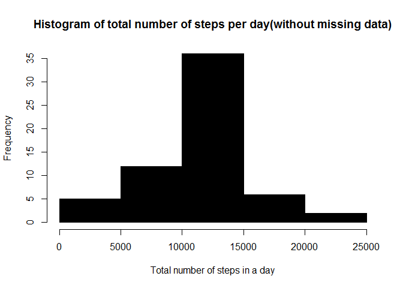

# Reproducible Research: Peer Assessment 1


```r
getwd()
```

```
## [1] "C:/Users/s212400096/Dropbox/datasciencecoursera/RepData_PeerAssessment1"
```


## Loading and preprocessing the data

```r
library(lubridate)
## Get file name and its location

setwd("C:/Users/s212400096/Dropbox/datasciencecoursera/RepData_PeerAssessment1/activity")
alldata <- read.csv("activity.csv")

mydata <- alldata[complete.cases(alldata),]
noofrows <- nrow(mydata)
mydata$date <- ymd(mydata$date)
```


## What is mean total number of steps taken per day?
1. The Histogram below provides the total number of steps per day

```r
aggdata <-aggregate(steps ~ date, data= mydata, sum)

hist(aggdata$steps, col=1, main="Histogram of total number of steps per day", 
     xlab="Total number of steps in a day")
```

 


2. Mean of  total number of steps per day 
   (convert the result to integer because there is no decimal steps)


```r
as.integer(mean(aggdata$steps))
```

```
## [1] 10766
```

3. Media of  total number of steps per day


```r
as.integer(median(aggdata$steps))
```

```
## [1] 10765
```
## What is the average daily activity pattern?

Time series plot


```r
# aggregate steps as interval to get average number of steps in an interval across all days
interval_steps <- aggregate(steps ~ interval, mydata, mean)

# generate the line plot of the 5-minute interval (x-axis) and the average number of 
# steps taken, averaged across all days (y-axis)
plot(interval_steps$interval, interval_steps$steps, type='l', col=1, 
     main="Average number of steps averaged over all days", xlab="Interval", 
     ylab="Average number of steps")
```

 


```r
max_interval <- interval_steps[which.max(interval_steps$steps),1]
```
2. The 5-minute interval, on average across all the days in the dataset that contains the maximum number of steps is: 835

## Imputing missing values
1. Total number of missing Data


```r
missingdata <- alldata[which(is.na(alldata$ste)),]
missingdatarows <- nrow(missingdata)
```
There are 2304 rows with missing data

2. Replace missing data with mean for the day
3. We use the mean for each of the 5min interval as a replacement of the missing data
   To achieve this we loop through the data and replace the missing data with the mean of the corresponding interval
   Then we create a new dataset that is now updated 

```r
updateddata <- alldata

intervalstepsmean <- aggregate(steps ~ interval, data= mydata, mean)  
for (i in 1:nrow(updateddata)){
        if (is.na(updateddata[i,"steps"])) {
             updateddata[i,"steps"] <- as.integer(intervalstepsmean[which(intervalstepsmean$interval == updateddata[i, "interval"]), "steps"])
     
        }
}
```

4a. Histogram of the steps taken daily with the new dataset


```r
aggdatawithoutna <-aggregate(steps ~ date, data= updateddata, sum)

hist(aggdatawithoutna$steps, col=1, main="Histogram of total number of steps per day(without missing data)", 
     xlab="Total number of steps in a day")
```

 

```r
newmean <- as.integer(mean(aggdatawithoutna$steps))
newmedia <- as.integer(median(aggdatawithoutna$steps))
```

The mean total number of steps taken per day without the missing data is: 10749

The mean total number of steps taken per day without the missing data is: 10641


## Are there differences in activity patterns between weekdays and weekends?
1. We create a new variable that indicate whether data is a week day or a weekend


```r
updateddata$daytype <- weekdays(as.Date(updateddata$date))

for (i in 1:nrow(updateddata)){
        if (updateddata[i, "daytype"] == "Saturday" | updateddata[i, "daytype"]  == "Sunday") {
                updateddata[i, "daytype"] <- "Weekend"
        } else {
                 updateddata[i, "daytype"] <- "Weekday"  
        }
}
```

2. Next we use the ggplot2 package to create time series plots to compare activity patterns between weekdays and weekends


```r
library(ggplot2)

interval_steps_na <- aggregate(steps ~ interval+daytype, updateddata, mean)

qplot(interval, steps, data=interval_steps_na, geom=c("line"), xlab="Interval", 
      ylab="Number of steps", main="") + facet_wrap(~ daytype, ncol=1)
```

 

The plots above indicate that there is a difference in the pattern of activity.
e.g. The sampled person took more steps in the early hours of weekdays than on weekends.
